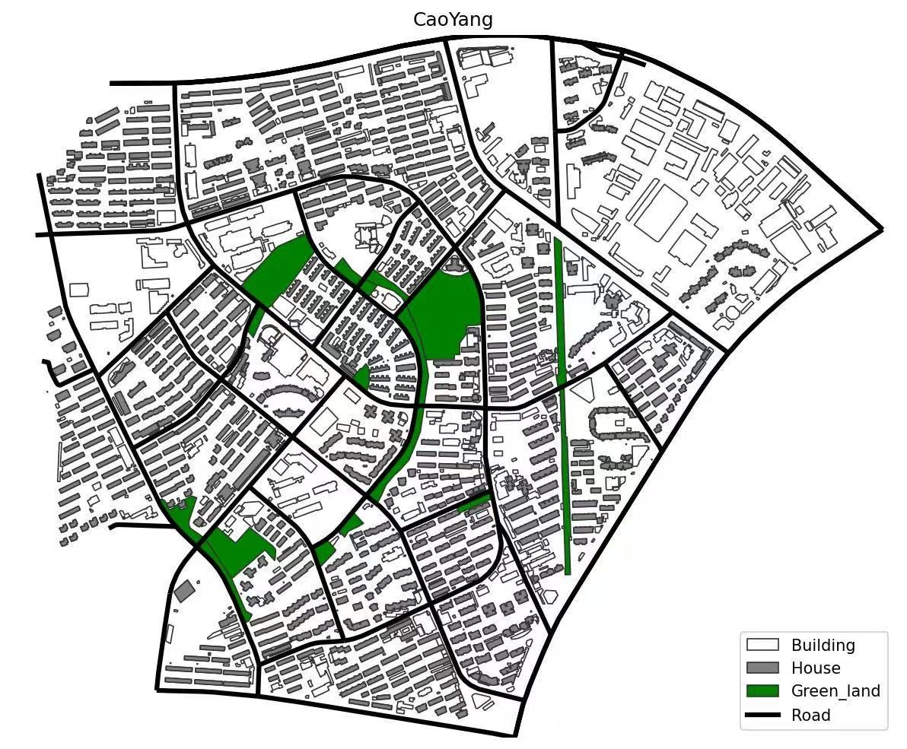
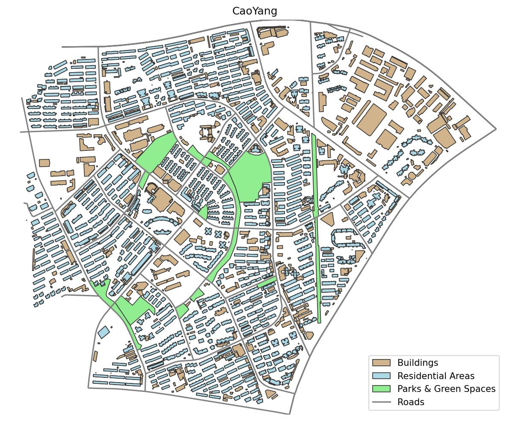
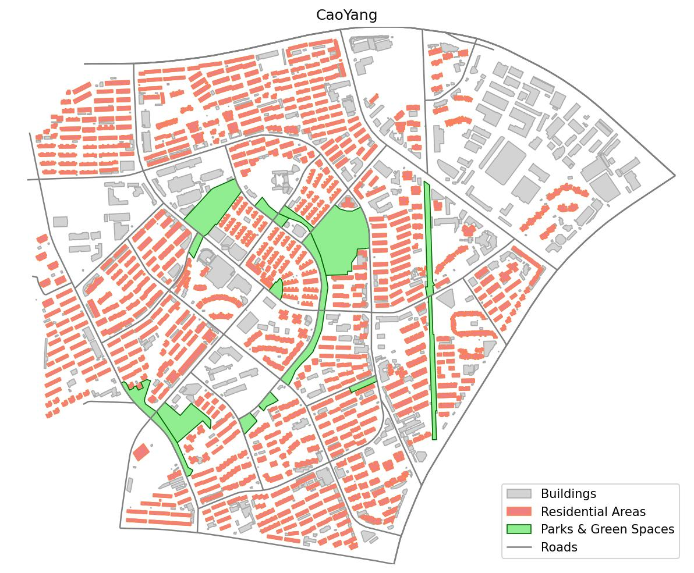
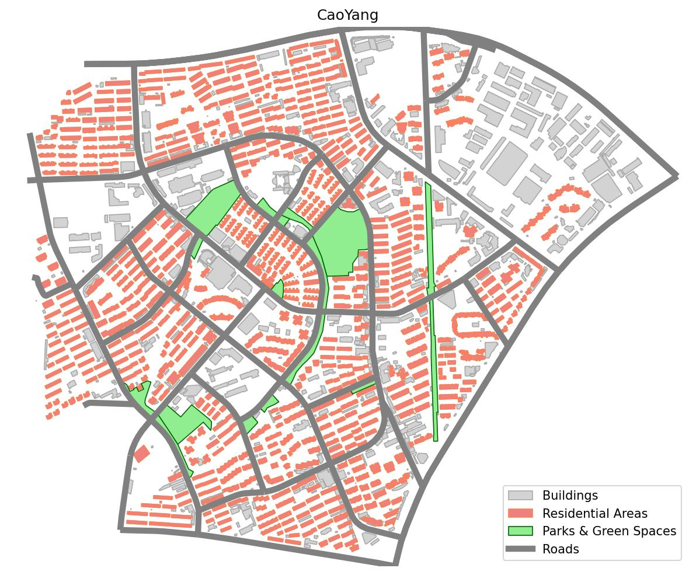
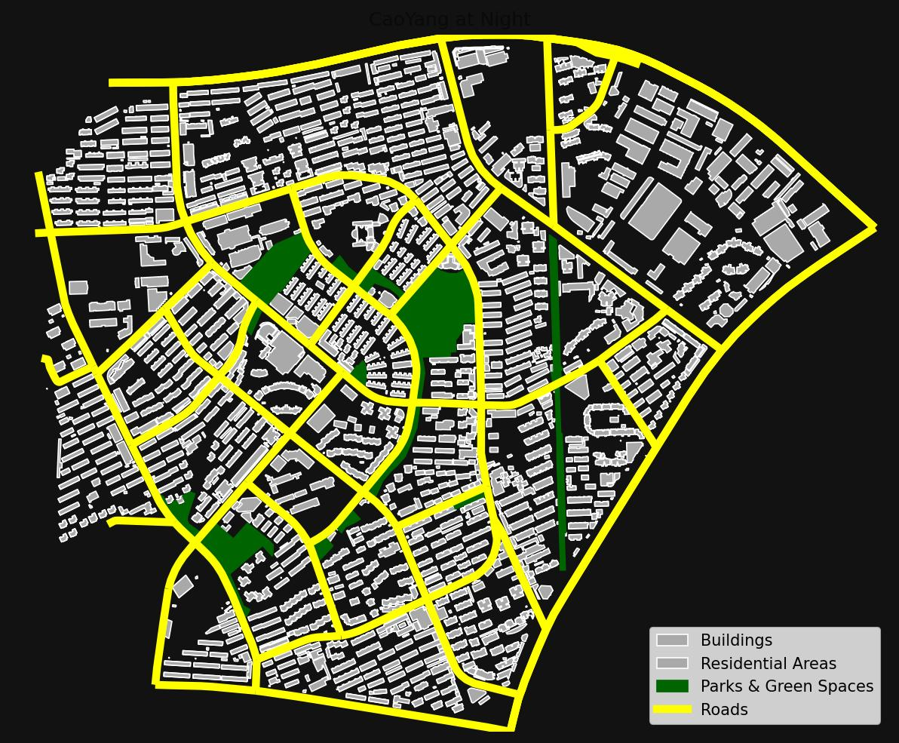

# 🗺️ MapGPT Agent

MapGPT Agent 是一个基于大语言模型（LLM）的智能代理，可以通过自然语言指令来创建、修改和导出地理空间地图。它结合了 LangGraph 的状态机能力、 LLM 的推理能力以及一系列地理信息处理工具，实现了从需求到地图的自动化生成，所导出的地图实现了三个模块：1. 要素 2. 图例 3. 标题

**本项目当前主要基于 DeepSeek API 进行开发与测试，与其他模型（如 OpenAI）的兼容性待验证。**

这个项目展示了如何构建一个能够理解多步骤、有上下文、可迭代修改任务的 Agent。

## ✨ 核心特性

* **自然语言理解**: 直接用日常语言下达制图指令，如“以`/path/~.shp`为底图范围，添加`/path/~.shp`并设置颜色为黄色，设置其标签为`～`，添加标题为`～`，设置图例并导出到`/path/~.jpg`”。
* **多工具协作**: Agent 能够自主规划并调用一系列工具 (`map_initial`, `map_add_layer`, `modify_line_color` 等) 来完成复杂任务。
* **上下文记忆与迭代修改**: 通过会话历史文件 (`session.json`)，Agent 能够“记住”上一轮的地图创建过程，并在此基础上进行修改，实现多轮对话式制图。
* **高度可定制的工作流**: 核心逻辑由 `agent.py` 中的系统提示词（System Prompt）驱动，可以通过修改提示词中的规则来精细调整 Agent 的行为模式。
* **支持多种地理数据**: 底层工具集通过 `geopandas` 和 `rasterio` 支持常见的矢量 (`.shp`, `.geojson`) 和栅格 (`.tif`) 数据格式。
* **灵活的 LLM 框架**: 代码结构支持切换不同 LLM。**当前已针对 DeepSeek 模型进行深度优化和测试。**

## 🚀 工作原理

MapGPT Agent 的核心是一个基于 LangGraph 构建的状态机。它的工作流程如下：

1.  **指令解析**: `main.py` 接收用户通过命令行输入的自然语言指令。
2.  **状态初始化**: `agent.py` 将用户指令和（可选的）历史记录包装成一个详细的系统提示词，并初始化 Agent 的状态。
3.  **ReAct 循环**: Agent 进入一个“思考 -> 行动 -> 观察”的循环：
    * **思考 (Thought)**: LLM 根据当前目标和上一步的观察结果，决定下一步该做什么。
    * **行动 (Action)**: LLM 选择一个合适的工具并提供输入。
    * **观察 (Observation)**: `tools.py` 中的工具被执行，并将结果返回给 Agent。
4.  **迭代执行**: 这个循环不断重复，Agent 会逐步完成地图的初始化、图层添加、样式修改、图例和标题设置等所有步骤。
5.  **多轮记忆**: 当一轮任务结束后，完整的消息历史可以被序列化并保存到 JSON 文件中，为下一次的迭代修改提供上下文。

## ⚙️ 安装与配置

### 1. 克隆仓库

```bash
git clone https://github.com/RadioactiveC/map-agent.git
cd map-agent-main
```

### 2. 创建虚拟环境并安装依赖

建议使用虚拟环境（如 venv 或 conda）。

```bash
# 创建并激活虚拟环境 (以 venv 为例)
python -m venv venv
source venv/bin/activate  # macOS/Linux
# venv\Scripts\activate    # Windows

# 安装依赖
pip install -r requirements.txt
```
*注意: 您需要创建一个 `requirements.txt` 文件，包含以下内容：*
```
langchain
langgraph
langchain-openai
langchain-deepseek
geopandas
matplotlib
rasterio
typing_extensions
```

### 3. 配置 API 密钥

Agent 的运行需要一个大语言模型（LLM）的 API 密钥。**本项目主要使用 DeepSeek 进行测试。**

* **方式一：环境变量（推荐）**
    将您的 API 密钥设置为环境变量。
    ```bash
    # For DeepSeek (主要测试模型)
    export DEEPSEEK_API_KEY="sk-..."

    # For OpenAI (待测试)
    export OPENAI_API_KEY="sk-..."
    ```

* **方式二：直接在代码中设置（不推荐用于生产）**
    您可以直接修改 `agent.py` 中的 LLM 初始化部分来传入密钥。

## ⚠️ 重要说明 (Important Notes)

* **测试文件格式**: 本项目的测试主要使用 `.shp` 矢量文件作为输入，并导出为 `.jpg` 格式。虽然代码支持其他地理空间格式（如 `.geojson`, `.tif`）和输出格式（如 `.png`），但其兼容性未经全面测试。
* **关于中文字符**: 为了确保地图中的标题和图例标签能够正确显示，**强烈建议在提示词中使用英文字符**。由于底层绘图库 `matplotlib` 的默认字体可能不包含中文字体，直接使用中文可能会导致文字显示为方框（乱码）。
* **关于数据目录**: 为了确保输入要素数据能被正确解析，请用单引号包裹绝对路径以输入（如 `'/Users/henry/Desktop/Cehui_data/data/曹杨新村街道.shp'`），同时建议指定地图输出的路径（默认输出位置为当前项目文件夹）。

## 用法 (Usage)

所有操作都通过 `main.py` 执行。

**注意**：以下所有示例均使用 `deepseek-chat` 模型进行测试。您可以通过 `-m` 参数更换模型。

### 示例 1：精确分步控制

在这个示例中，我们为 Agent 提供了非常详细、按部就班的指令。这适用于您需要对地图的每一个要素进行精确控制的场景。

**终端命令:**
```bash
python main.py -q "1.用'/Users/henry/Desktop/Cehui_data/data/曹杨新村街道.shp'初始化底图；2.设置底图颜色为白色；3.添加'/Users/henry/Desktop/Cehui_data/data/房屋_曹杨新村街道.shp’，并给它一个“Building”标签；4.设置polygon的面颜色为灰色；5.添加’/Users/henry/Desktop/Cehui_data/data/住宅_曹杨新村街道.shp’，并给它一个“House”标签；6.设置polygon的面颜色为绿色；7.添加’/Users/henry/Desktop/Cehui_data/data/公园绿地_曹杨新村街道.shp’，并给它一个“Green_land”标签；8.设置line的颜色为黑色，并设置宽度为“3”；9.添加’/Users/henry/Desktop/Cehui_data/data/道路_曹杨新村街道.shp’，并给它一个“Road”标签；10.设置标题颜色为黑色；11.设置标题文字为“CaoYang”；12.添加图例，放置在右下角；13.将结果保存到'/Users/henry/Desktop/Cehui_data/data/out.jpg'" -m deepseek-chat
```

**预期输出结果:**




---

### 示例 2：给予 Agent 创造性自由

与上一个示例不同，这里我们只提供高阶目标（需要哪些图层，最终要什么效果），并让 Agent 自主决定美化方案（如配色、线宽、图例名称等）。这适用于快速原型设计或您希望利用 LLM 的“审美”能力的场景。

**终端命令:**
```bash
python main.py -q "帮我以'/Users/henry/Desktop/Cehui_data/data/曹杨新村街道.shp'为底图范围，然后添加'/Users/henry/Desktop/Cehui_data/data/房屋_曹杨新村街道.shp'图层、'/Users/henry/Desktop/Cehui_data/data/住宅_曹杨新村街道.shp'、'/Users/henry/Desktop/Cehui_data/data/公园绿地_曹杨新村街道.shp'、'/Users/henry/Desktop/Cehui_data/data/道路_曹杨新村街道.shp'，帮我以美观合适的方式调整这些图层的格式与配色，并以合适的英文名称设置它们的图例，最后设置名称为‘CaoYang’并导出结果到'/Users/henry/Desktop/Cehui_data/data/out.jpg'" -m deepseek-chat
```

**预期输出结果:**




---

### 示例 3：多轮对话与迭代修改

这是 MapGPT Agent 的“记忆”功能。我们首先创建一个初始版本的地图并保存会话，往后的每一轮在将基于上一轮的结果进行修改。

#### 第 1 轮：创建初始地图并保存会话

**终端命令:**
```bash
python main.py \
 -q "帮我以'/Users/henry/Desktop/Cehui_data/data/曹杨新村街道.shp'为底图范围，然后添加'/Users/henry/Desktop/Cehui_data/data/房屋_曹杨新村街道.shp'图层、'/Users/henry/Desktop/Cehui_data/data/住宅_曹杨新村街道.shp'、'/Users/henry/Desktop/Cehui_data/data/公园绿地_曹杨新村街道.shp'、'/Users/henry/Desktop/Cehui_data/data/道路_曹杨新村街道.shp'，帮我以美观合适的方式调整这些图层的格式与配色，并以合适的英文名称设置它们的图例，最后设置名称为‘CaoYang’并导出结果到'/Users/henry/Desktop/Cehui_data/data/out.jpg'" \
 -m deepseek-chat \
 -s map_session.json
```

**第一轮输出结果:**




#### 第 2 轮：加载会话并提出修改

在上一轮的基础上，我们现在要求 Agent 只将道路线宽调整为‘5’，而无需重复其他指令。

**终端命令:**
```bash
python main.py \
 -q "上次导出的图还不错，就是感觉道路shp的线宽太窄，能不能帮我调整到‘5’的宽度" \
 -m deepseek-chat \
 -s map_session.json
```

**第二轮修改后的输出结果:**



#### 第 3 轮：进一步提出“夜间模式”的复杂修改

在上一轮的基础上，我们现在要求 Agent 根据前一轮结果去进行复杂调整，这要求 Agent 必须完全理解前一轮的所有步骤。

**终端命令:**
```bash
python main.py \
 -q "参考上一轮的地图，我们来做一个'夜间模式'的大改版。请按以下要求重新生成地图：
1. 首先，将背景彻底换成深黑色（例如'#121212'）。
2. 道路要模拟成夜晚被路灯照亮的感觉，请把它的颜色改成亮黄色。
3. 所有建筑物（房屋和住宅）的填充色改为深灰色，但给它们一个明亮的白色边框来凸显夜晚的轮廓。
4. 公园绿地在夜晚应该是几乎看不见的，请把它改成非常深的暗绿色。
5. 最后，把标题改为'CaoYang at Night'，图例保持不变，然后将新地图保存到'/Users/henry/Desktop/Cehui_data/data/out_night_v2.jpg'。" \
 -m deepseek-chat \
 -s map_session_night.json
```

**第三轮修改后的输出结果:**



#### 第 4 轮：进一步调整标题

上一轮的标题融到背景里去了，我们直白地告诉模型：上一轮生成的地图不错，就是标题融入背景色了，麻烦调整下标题的颜色，然后将新地图保存到 `‘/path/’`。

**终端命令:**
```bash
python main.py \
 -q "上一轮生成的地图不错，就是标题融入背景色了，麻烦调整下标题的颜色，然后将新地图保存到'/Users/henry/Desktop/Cehui_data/data/out_night_v3.jpg'。" \
 -m deepseek-chat \
 -s map_session.json \
```

**第四轮修改后的输出结果:**


## 📂 项目结构

```
.
├── Images/               # 存放 README 中的示例图片
│   ├── out.jpg
│   └── ...
├── mapgpt/
│   ├── init.py
│   ├── agent.py        # Agent的核心逻辑，包含System Prompt和LangGraph状态机
│   └── tools.py        # 所有地图操作工具的实现和注册
├── main.py             # CLI入口，负责参数解析、加载/保存历史、调用Agent
├── requirements.txt    # 项目依赖
├── LICENSE             # MIT 许可证文件
└── README.md           # 本文件
```

## 🧠 关于系统提示词 (System Prompt)

Agent 的所有行为和工作流程都由 `agent.py` 中的 `SYS_PROMPT_TEMPLATE` 变量严格规定。我们已经通过多轮迭代，使其具备了非常清晰的制图逻辑，包括：

* **四阶段工作流**: 初始化（根据初始化图层确定地图范围） -> 构建与样式（要素层叠加与样式调整） -> 标题与图例设置（可选操作，图例位置可调整） -> 保存。
* **上下文处理**: 明确规定了在有历史记录时如何执行“修改”任务。
* **严格的格式要求**: 通过正反面教材与地图绘制流程规范，确保 LLM 输出格式的稳定性。

如果您想进一步调整 Agent 的行为，修改此提示词是最高效的方式。

## 🤝 贡献

欢迎对本项目进行贡献！如果您有任何想法或建议，请随时提交 Pull Request 或创建 Issue。

## 📄 许可证

本项目采用 [MIT License](LICENSE)。